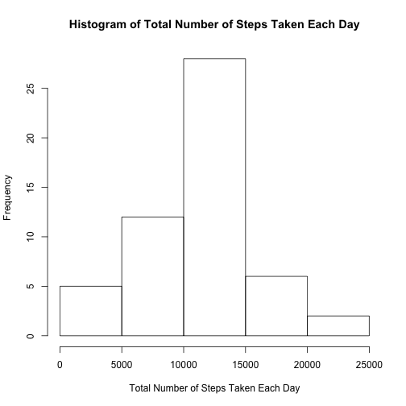
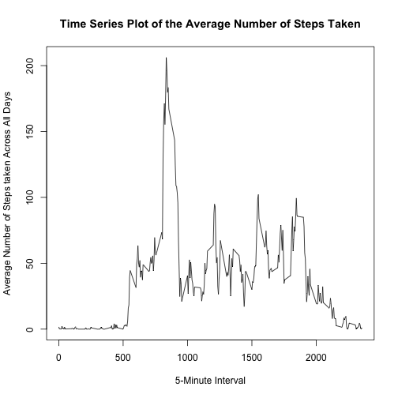
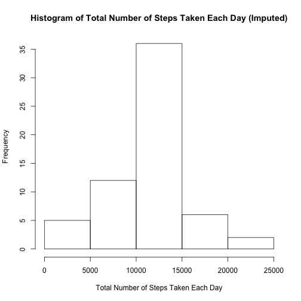
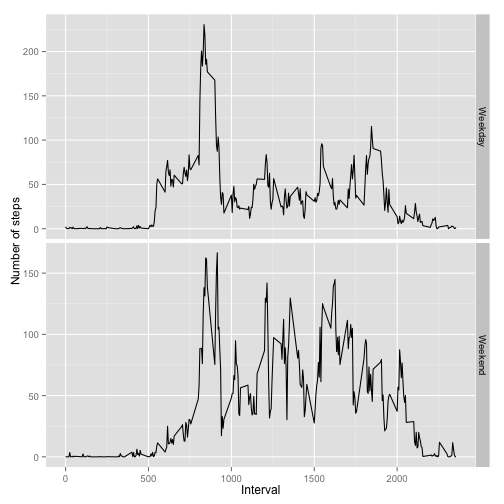

## Loading and preprocessing the data

```r
if (!(file.exists("activity.csv"))){
    unzip("activity.zip")
}

activity <- read.csv("activity.csv")
```

## What is mean total number of steps taken per day?

First, calculate total number of steps taken per day. 

```r
daysum <- with(activity, tapply(steps, date, sum))
```

The total number of steps taken per day is shown in the following histogram.

```r
### histogram of total number of steps taken each day ###
hist(daysum, xlab="Total Number of Steps Taken Each Day", main="Histogram of Total Number of Steps Taken Each Day")
```

 

Second, calculate the mean and median of total number of steps taken per day.

```r
daysum.mean <- mean(daysum, na.rm=T)
daysum.median <- median(daysum, na.rm=T)
```
The mean is 1.0766189 &times; 10<sup>4</sup>.  The median is 10765.

## What is the average daily activity pattern?
The code below calculates the average number of steps taken for each 5-min interval across all days.

```r
intervalmean <- with(activity, tapply(steps, interval, mean, na.rm=T))
```

Then we plot the time series data.

```r
intervallabel <- unique(activity$interval)
plot(intervallabel, intervalmean, type="l", 
     xlab="5-Minute Interval", ylab="Average Number of Steps taken Across All Days", 
     main="Time Series Plot of the Average Number of Steps Taken")
```

 

To find which interval has the maximum average number of steps taken:

```r
maxinter <- intervallabel[which.max(intervalmean)]
```
The maximum average number of steps is taken in interval 835.

## Imputing missing values

Code for calculating the total number of missing values in the dataset:

```r
missinginx <- is.na(activity$steps)
Nmissing <- sum(missinginx)
```
The total number of missing values in the dataset is 2304.

Impute missing steps using the mean of the corresponding 5-minute interval:

```r
intervalmean.rep <- rep(intervalmean, length(unique(activity$date)))
steps.impute <- activity$steps
steps.impute[missinginx] <- intervalmean.rep[missinginx]
```

Create new dataset = activity data with missing steps imputed:

```r
activity.impute <- activity
activity.impute$steps <- steps.impute
```

Make a histogram of the total number of steps taken each day:

```r
daysum.impute <- with(activity.impute, tapply(steps, date, sum))
hist(daysum.impute, xlab="Total Number of Steps Taken Each Day", 
     main="Histogram of Total Number of Steps Taken Each Day (Imputed)")
```

 

Calculate the mean and median of the total number of steps taken per day for the imputed data:

```r
daysum.mean.impute <- mean(daysum.impute)
daysum.median.impute <- median(daysum.impute)
```
The mean and median for the imputed data are 1.0766189 &times; 10<sup>4</sup> and 1.0766189 &times; 10<sup>4</sup>, respectively.  Using mean of the corresponding 5-minute interval to impute the missing data, mean of the imputed data is the same as before while median differs.  Using the imputed data, the point estimate for the total daily number of steps does not change if we use mean to estimate, but confidence interval of the estimate becomes narrower.


## Are there differences in activity patterns between weekdays and weekends?

Create “weekday” and “weekend” indicator 

```r
whichday <- weekdays(as.Date(activity.impute$date))
weekday.inx <- ifelse(whichday != "Saturday" & whichday != "Sunday", "Weekday", "Weekend")
```

Panel plot of weekday and weekend 5-min interval averages 

```r
library(ggplot2)
activity.impute$weekday.inx <- weekday.inx
ggplot(activity.impute, aes(x=interval, y=steps)) + facet_grid(weekday.inx ~ ., scales="free_y") + 
    stat_summary(fun.y="mean", geom="line") + 
    xlab("Interval") + ylab("Number of steps")
```

 
The patterns for weekday and weekend are different: weekday has 1 peak while the rest of the intervals have few steps taken while weekend has multiple peaks and the overall number of steps taken is larger.

